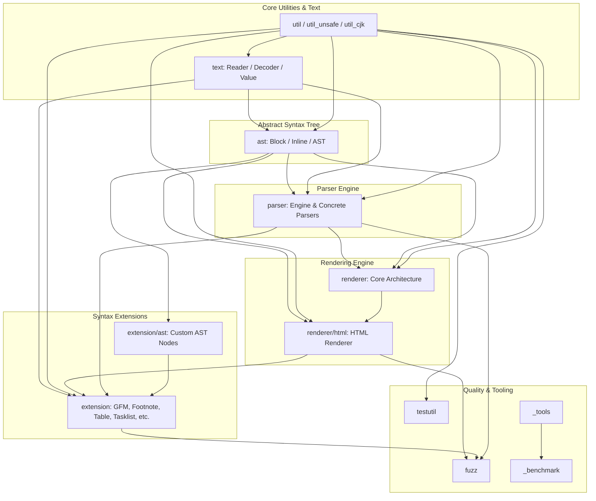

# Software Architecture Documentation

## Overview

This repository provides a modular, extensible Markdown parsing and rendering engine written in Go. The architecture follows a multi-tiered pipeline design: low-level text and byte manipulation utilities feed into a flexible Abstract Syntax Tree (AST) construct, which is populated by a configurable block and inline parsing subsystem, extended via specialized syntax modules, and ultimately transformed into HTML (or other custom formats) via a renderer pipeline.

---

## Core Architectural Layers

The system is organized into six primary architectural layers:

1. **Utility & Text Processing Infrastructure (`util/`, `text/`)**
   Provides zero-copy byte conversions, buffer utilities, CJK rune processing, HTML entity lookup, Unicode case folding, and streaming reader abstractions.
2. **Abstract Syntax Tree (`ast/`, `extension/ast/`)**
   Defines node structures for document elements (blocks and inlines), node traversal (`Walk`), and specialized node kinds for extensions.
3. **Parser Subsystem (`parser/`)**
   Contains the core parsing engine alongside discrete parsers for CommonMark block elements (headings, lists, blockquotes, code blocks, thematic breaks, HTML blocks) and inline elements (emphasis, links, auto-links, code spans, attributes).
4. **Renderer Subsystem (`renderer/`, `renderer/html/`)**
   Defines rendering interfaces, options, and context management, along with an HTML implementation for emitting formatted output from the AST.
5. **Extensions Layer (`extension/`)**
   Implements syntax extensions such as GitHub Flavored Markdown (GFM), Footnotes, Tables, Task Lists, Strikethrough, Definition Lists, Linkify, and Typographer.
6. **Tooling, Benchmarks, and Fuzzing (`_tools/`, `_benchmark/`, `fuzz/`, `testutil/`)**
   Supports developer workflows, code generation for Unicode mappings/embedded structs, performance benchmarking against reference implementations, and fuzz testing.

---

## Subsystem Dependency Diagram



---

## Detailed Subsystem Breakdown

### 1. Utility & Text Layer (`util/`, `text/`)

The utility and text layer forms the base of the entire dependency tree.

* **`util/util.go` & `util/util_unsafe.go` / `util/util_safe.go`**: Provides optimized byte-to-string and string-to-byte conversions (`BytesToReadOnlyString`, `StringToReadOnlyBytes`), space detection/trimming, tab width calculations, and HTML escaping (`EscapeHTML`).
* **`util/util_cjk.go`**: Provides rune classification routines specific to East Asian scripts (`IsEastAsianWideRune`, `IsSpaceDiscardingUnicodeRune`).
* **`util/html5entities.go` & `util/unicode_case_folding.go`**: Implements entity decoding lookups and Unicode case-folding maps.
* **`text/reader.go` & `text/value.go`**: Provides low-level abstractions (`NewReader`, `NewBlockReader`, `NewSegment`) for traversing and slicing input text buffers without unnecessary allocation.
* **`text/decoder.go`**: Handles character decoding, HTML entity conversion, and space handling (`NewDecoder`, `WithEscapedSpace`).

### 2. Abstract Syntax Tree Layer (`ast/`, `extension/ast/`)

The AST packages define the hierarchy of nodes generated during parsing.

* **`ast/ast.go`**: Defines generic node structures, node kinds (`NewNodeKind`), node dumps (`NewNodeDump`), and AST traversal (`Walk`).
* **`ast/block.go`**: Implements block-level structural nodes (`NewDocument`, `NewParagraph`, `NewHeading`, `NewThematicBreak`, `NewCodeBlock`, `NewBlockquote`, `NewList`, `NewListItem`, `NewHTMLBlock`, `NewLinkReferenceDefinition`).
* **`ast/inline.go`**: Implements inline-level content nodes (`NewText`, `NewCodeSpan`, `NewEmphasis`, `NewStrong`, `NewLink`, `NewImage`, `NewAutoLink`, `NewRawHTML`).
* **`extension/ast/`**: Houses AST node definitions dedicated to extensions:
  * `footnote.go` (`NewFootnoteReference`, `NewFootnoteDefinition`)
  * `table.go` (`NewTable`, `NewTableRow`, `NewTableHeader`, `NewTableCell`, `NewTableBody`)
  * `strikethrough.go` (`NewStrikethrough`)
  * `definition_list.go` (`NewDefinitionList`, `NewDefinitionTerm`, `NewDefinitionDescription`)

### 3. Parser Subsystem (`parser/`)

The parser package orchestrates the transformation of text readers into AST nodes through configurable block and inline parsers.

* **Main Parser Orchestrator (`parser/parser.go`)**:
  * Exposes builder and parser configuration functions (`New`, `WithBlockParsers`, `WithInlineParsers`, `WithASTTransformers`, `WithParagraphTransformers`, `NewCommonMark`).
  * Manages parsing context (`NewContext`, `NewIDs`).
* **Block Parsers**:
  * `atx_heading.go` (`NewATXHeadingParser`)
  * `setext_headings.go` (`NewSetextHeadingParser`)
  * `list.go` & `list_item.go` (`NewListParser`, `NewListItemParser`)
  * `blockquote.go` (`NewBlockquoteParser`)
  * `code_block.go` & `fcode_block.go` (`NewCodeBlockParser`, `NewFencedCodeBlockParser`)
  * `html_block.go` (`NewHTMLBlockParser`)
  * `paragraph.go` (`NewParagraphParser`)
  * `thematic_break.go` (`NewThematicBreakParser`)
* **Inline Parsers & Delimiters**:
  * `delimiter.go` (`ParseDelimiter`, `ProcessDelimiters`): Handles delimiter runs for inline formatting.
  * `emphasis.go` (`NewEmphasisParser`)
  * `link.go` & `link_ref.go` (`NewLinkParser`, `parseLinkReferenceDefinition`)
  * `auto_link.go` (`NewAutoLinkParser`)
  * `code_span.go` (`NewCodeSpanParser`)
  * `raw_html.go` (`NewRawHTMLParser`)
  * `attribute.go` & `attribute_v1.go` (`ParseAttributes`): Custom attribute syntax parsing.

### 4. Renderer Subsystem (`renderer/`)

The renderer layer processes the AST and outputs target representations.

* **`renderer/renderer.go`**: Defines the rendering infrastructure, option handlers (`WithNodeRenderers`, `WithNodeRendererDecorators`, `WithExtensions`), and rendering context creation (`NewContext`).
* **`renderer/html/html.go`**: Implements the HTML output generator (`New`, `NewCommonMark`), providing configuration for XHTML tags (`WithXHTML`), unsafe content execution (`WithUnsafe`), hard wraps (`WithHardWraps`), and link attributes (`IsDangerousURL`, `RenderAttributes`).

### 5. Extensions System (`extension/`)

Extensions build upon the core `parser` and `renderer` primitives to support enhanced markdown syntaxes.

* **`extension/gfm.go`**: Aggregates GitHub Flavored Markdown components via `NewGFMParser` and `NewGFMHTMLRenderer`.
* **`extension/table.go`**: Implements pipe table parsing (`NewTableParser`) and HTML rendering (`NewTableHTMLRenderer`).
* **`extension/footnote.go`**: Handles footnote references/definitions (`NewFootnoteParser`, `NewFootnoteHTMLRenderer`, `ContextFootnotes`).
* **`extension/tasklist.go`**: Parses and renders task list item checkboxes (`NewTaskListItemParser`, `NewTaskListItemHTMLRenderer`).
* **`extension/strikethrough.go`**: Adds strikethrough parsing via delimiter runs (`NewStrikethroughParser`, `NewStrikethroughHTMLRenderer`).
* **`extension/linkify.go`**: Automatically detects URLs, WWW addresses, and email addresses (`NewLinkifyParser`, `WithAllowedProtocols`).
* **`extension/definition_list.go`**: Adds support for definition lists (`NewDefinitionListParser`, `NewDefinitionListHTMLRenderer`).
* **`extension/typographer.go`**: Adds typographic substitutions for quotes and punctuation (`NewTypographerParser`).

### 6. Tools, Benchmarks, & Fuzzing

* **`_tools/`**: Contains code generation programs (`main.go`, `gen-emb-structs.go`, `gen-oss-fuzz-corpus.go`, `gen-unicode-case-folding-map.go`).
* **`_benchmark/`**: Benchmark suites comparing performance (`_benchmark/go/benchmark_test.go`, `_benchmark/cmark/goldmark_benchmark.go`).
* **`fuzz/`**: Fuzzing integration (`fuzz_test.go`, `oss_fuzz_test.go`) validating parser stability across standard and extension parsers.
* **`testutil/`**: Shared assertion and diffing logic (`testutil.go`, `DoTestCases`, `DiffPretty`).

---

## Data Pipeline Execution Flow

```
[ Input Markdown Text ]
          │
          ▼
   text.NewReader()           ──(Decodes input, tracks offsets, manages lines)
          │
          ▼
   parser.Parse()             ──(Executes Block and Inline Parsers)
          │
          ├────────────────► [ Block Processing: Headings, Lists, Code blocks ]
          ├────────────────► [ Inline Processing: Delimiters, Links, Emphasis ]
          └────────────────► [ Extensions: Tables, Footnotes, Tasklists ]
          │
          ▼
     [ AST Tree ]             ──(Represented by ast.Node hierarchy)
          │
          ▼
   renderer.Render()          ──(Traverses AST via ast.Walk)
          │
          ▼
 renderer/html implementation ──(Applies NodeRenderers, unsafe filters, attributes)
          │
          ▼
    [ Output HTML ]
```